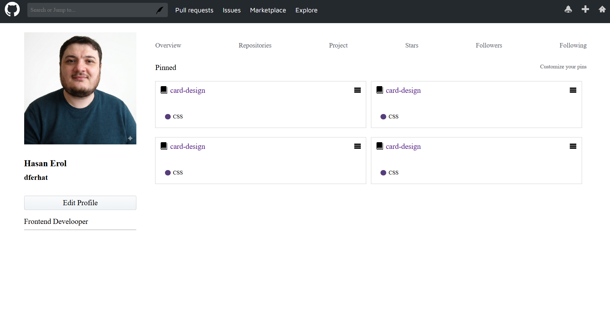

# GitHub Profile UI Clone (SCSS) 👤

Bu proje, GitHub'ın kullanıcı profili arayüzünü **SCSS** (Sass) kullanarak modernize edilmiş bir iş akışıyla yeniden oluşturduğum bir çalışmadır. Klasik CSS'in ötesine geçerek daha düzenli ve yönetilebilir bir kod yapısı hedeflenmiştir.

## 🚀 Öne Çıkanlar
* **SCSS Yapısı:** Değişkenler (variables) ve iç içe yazım (nesting) kullanılarak kod tekrarı önlendi.
* **Grid & Flexbox:** Repository kartları ve sayfa düzeni için modern yerleşim teknikleri kullanıldı.
* **Detaylı Klonlama:** Sidebar, navigasyon sekmeleri ve "Pinned" projeler alanı orijinale sadık kalınarak tasarlandı.

## 🛠️ Teknolojiler
* **HTML5:** Semantik yapı.
* **SCSS / CSS3:** Modüler stil yönetimi.

## 📸 Önizleme

---
*Bu çalışma, Udemig eğitim süreci kapsamında geliştirilmiş bir SCSS ödevidir.*